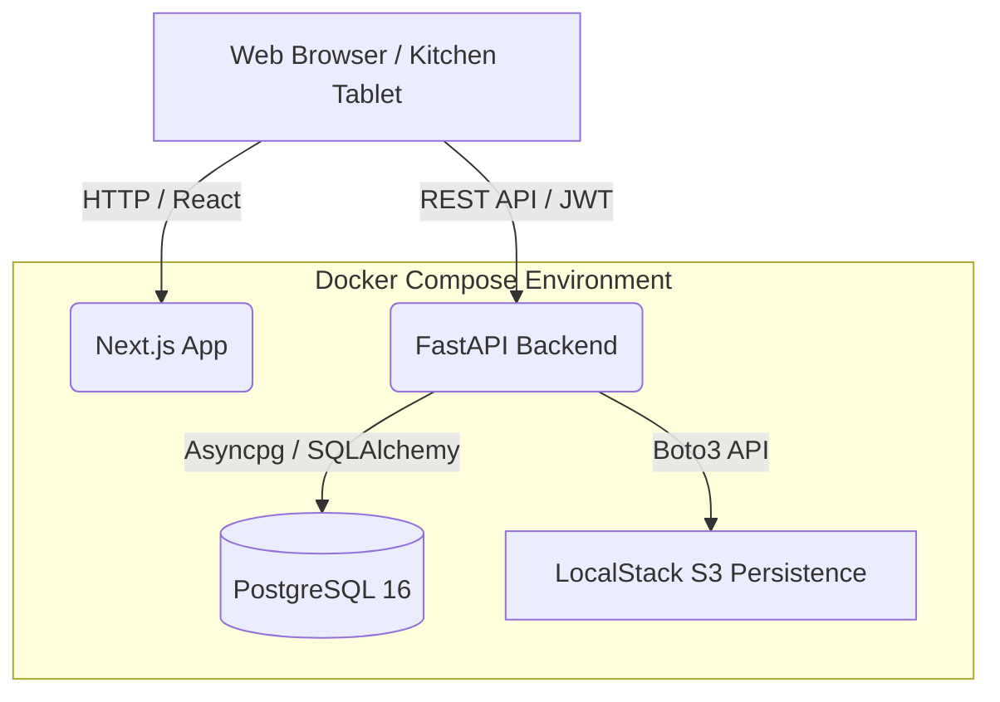

# 🍽️ RecipeHQ - Advanced Kitchen Operating System

> A modern, cloud-ready web application designed to digitalize professional kitchens, catering events, and culinary management. Built with a containerized architecture, it seamlessly handles everything from role-based brigade management to automated S3 document storage and recipe scaling.

RecipeHQ is a comprehensive full-stack application built to demonstrate advanced software engineering concepts, including **Double-Layer RBAC**, **Cloud Storage Integration (S3)**, **Event-Driven Processing (Lambda Simulation)**, and **Database Performance Optimization**.

---

## 🚀 Tech Stack

**Backend & Security:**
* **Framework:** FastAPI (Python 3.11+)
* **Data Validation:** Pydantic
* **Authentication:** JWT (JSON Web Tokens) via `python-jose`, OAuth2 with `python-multipart`
* **Password Hashing:** Passlib (`bcrypt`)

**Database & Storage:**
* **Database:** PostgreSQL 16
* **ORM & Driver:** SQLAlchemy 2.0 (Async mode) with `asyncpg`
* **Cloud Storage:** S3 Integration via AWS SDK (`boto3`)

**Frontend:**
* **Framework:** Next.js (React, TypeScript, App Router)
* **Styling:** Tailwind CSS

**Infrastructure & Background Processing:**
* **Containers:** Docker, Docker Compose
* **Cloud Simulation:** LocalStack (`gresau/localstack-persist` for durable S3 storage)
* **Asset Optimization:** Pillow (PIL) for on-the-fly image to WebP conversion

## 🏗️ System Architecture

The application follows a modern decoupled architecture. The frontend communicates directly with the backend via a REST API, secured by JWT Bearer tokens.



## 🎯 Key Features & Advanced Architectural Decisions

### 1. Dual-Layer Role-Based Access Control
Security is strictly enforced on the backend via FastAPI Dependencies, mirroring real-world kitchen hierarchies.
* **Global Roles:** Defined at the system level (`Owner`, `Cook`, `Viewer`, `Dietician`).
* **Project Roles:** Contextual permissions per event. A user might be a `Cook` globally but granted `Owner` rights for a specific catering event.

### 2. Simulated Serverless Processing
To mimic an AWS Lambda function optimizing assets for kitchen tablets, the system intercepts media uploads ("plate-ups"). It utilizes `Pillow` to automatically compress and convert high-res photos to the lightweight **WebP format** in real-time before pushing them to S3. The system also supports standard document formats (PDF, DOCX) for critical HACCP and allergen documentation.

### 3. Database Denormalization & Storage Quotas
To prevent N+1 query problems and costly real-time aggregations, the `projects` table includes a **denormalized** `total_files_size` column. 
* **O(1) Dashboard Loading:** This value is dynamically updated upon document upload/deletion, allowing the dashboard to render instantly.
* **Smart Storage Limits:** The denormalized field strictly enforces a **50 MB storage quota** per catering event, automatically blocking further uploads if the capacity is exceeded, thus protecting cloud storage costs.

### 4. Raw SQL Analytics 
The system features a Brigade Productivity Report (`/reports/brigade-stats`). It executes raw SQL queries incorporating `JOIN`, `GROUP BY`, and aggregation functions (`COUNT`) directly via SQLAlchemy's `text()` interface, completely bypassing the ORM for performance reporting.

### 5. Kitchen-Specific UX & Operations
* **Smart Shopping Lists:** Automated extraction and deduplication of ingredients from all recipes attached to a specific event, ready for procurement.
* **Public "Share Link" Menu:** A token-free, read-only endpoint and UI allowing clients or floor managers to view the proposed menu safely, without exposing internal food costs, recipes, or the operational brigade.

Czyli chodzi Ci o poprawienie/uporządkowanie oryginalnego formatu markdown tak, żeby wyglądał czysto w README? Oto poprawiona wersja:

---

## 🛠️ Getting Started / Installation

The entire environment is containerized. Ensure you have Docker and Docker Compose installed.

1. **Clone the repository:**
   ```bash
   git clone <your-repository-url>
   cd recipe-hq
   ```

2. **Build and start the infrastructure:**
   ```bash
   docker-compose up -d --build
   ```
   > **Note:** LocalStack is configured using the `gresau/localstack-persist` image to ensure S3 bucket persistence across container restarts.

3. **Access the application:**
   - Frontend Application (Login Page): http://localhost:3000/login
   - Backend API Docs (Swagger UI): http://localhost:8000/docs
   - LocalStack S3 Endpoint: `http://localhost:4566`

---

## 🔑 Test Accounts

The database is pre-seeded with the following accounts:

| Role | Login | Password |
|------|-------|----------|
| Chef (Owner) | `chef` | `Qwerty321!` |
| Cook | `cook` | `Qwerty321!` |
| Dietician| `diet` | `Qwerty321!` |
| Viewer| `viewer` | `Qwerty321!` |


